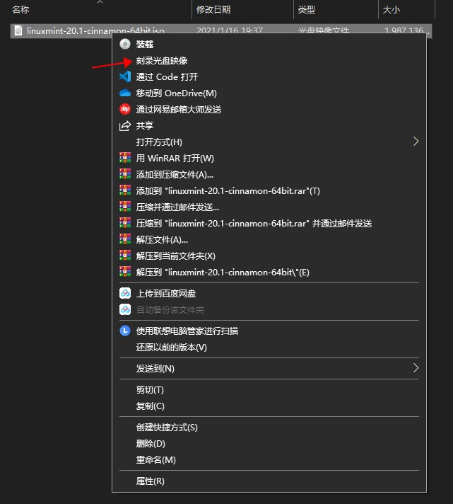
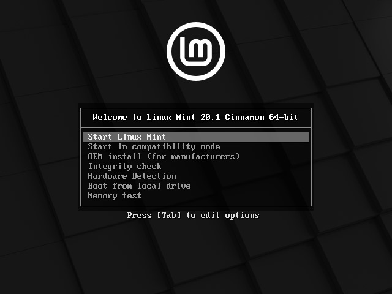
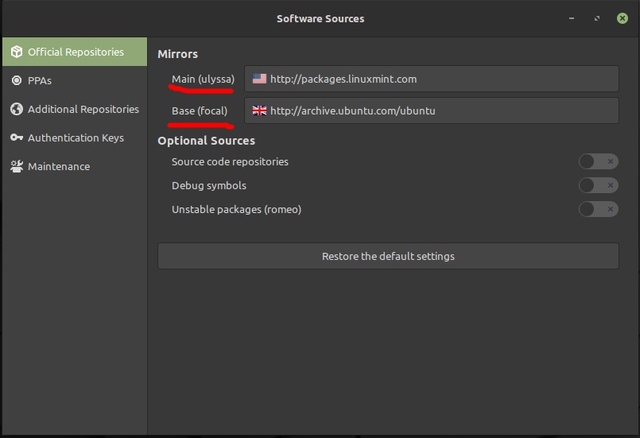
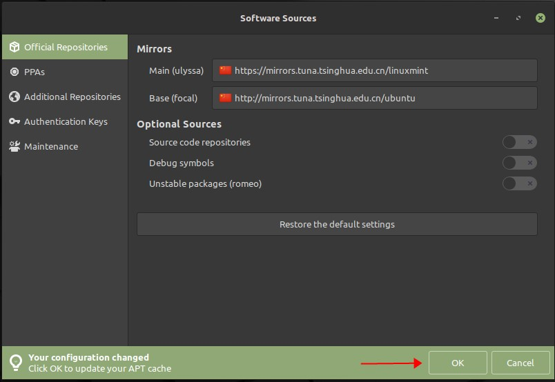

**[回到主页](../)**

# NVidia 显卡安装 Linux 的正确方式
## 安装准备
### 下载镜像
首先从官方网站或镜像站下载 Linux 的镜像，推荐的国内镜像是清华大学的[TUNA](https://mirrors.tuna.tsinghua.edu.cn/)镜像站，一般 `xxx-cd` 的文件夹就是安装镜像。

我比较喜欢 Cinnamon 的桌面环境，所以下载了 Linux Mint 的镜像。下载好之后是 `.iso` 文件，虚拟机可以直接用，物理机的话就需要分情况讨论了。

### 制作安装盘
如果电脑有光驱，直接右键刻录光盘镜像即可。



但是如果没有光驱，就需要使用 Rufus 制作启动盘。
- GitHub: [pbatard/rufus](https://github.com/pbatard/rufus)
- FastGit (国内推荐): [pbatard/rufus](https://hub.fastgit.org/pbatard/rufus)

一般来说，需要一个 4GB 以上的U盘。

## 开始安装
### 调整显卡的支持
首先，在 BIOS 中从 USB 启动。然后会看到类似这个的界面：



如果双系统的话，可能会有一点偏差，直接按照指引 Edit Option。应该会看到差不多这样的代码：

```
巴拉巴拉巴拉巴拉 quiet splash --
```

在 `quiet splash --` 前面加上 `nomodeset`，现在代码应该长这样：

```
巴拉巴拉巴拉巴拉 nomodeset quiet splash --
```

然后进入安装盘的系统就可以了。

### 安装系统
安装系统的时候最好是断网安装，不然软件的下载速度非常感人。

一路 Next，语言、额外编码之类的都不用管，直到磁盘编辑这步。

如果你只需要 Linux，可以清空整个磁盘并安装，不然的话请打开高级选项 (Something Else)，因为双系统并存的磁盘安装位置可能会很奇怪。

就像其他的分区管理软件一样，新建一个分区，文件系统用 `ext4`，`Mount Point` 选择根目录 `/`。

然后找到你系统的 EFI 分区，通常大小是 260MB，格式是 FAT32。选择 `Device for boot loader installation` 或安装 Grub 2 的分区或 `EFI System Partition` 之类的东西。

如果你有单独的存文件的分区，你可以给它也设置一个挂载点，比如挂载到 `/Files`。不设置挂载点也可以，一定程度上这还能加快开机速度。

然后就等它安装，我大概用了 5 分钟左右就好了。按照它的指引，重启。

## 驱动，软件
安装好之后，进入 BIOS，关闭 Secure Boot，再进系统。

启动之后，单系统开机时按住 `Shift` 进入 Grub。双系统会自动进入 Grub。按 `e` 进入编辑，和之前一样，在 `quiet splash --` 前面加上 `nomodeset`，然后进系统。

进系统第一件事，更换软件源。

打开 Software Sources，把这些软件源（不同的系统可能数量不同）全部换成五星红旗。





然后按照指引刷新软件源。

接着，再更换语言（需要安装软件包，换源之后应该很快）和输入法（Mint 有一键安装 Fcitx 框架的，网上相关资料很多）。

输入法的话我目前使用搜狗拼音输入法 Linux 版。

然后打开驱动管理器，(应该) 会默认使用 noveau 的开源驱动，改成推荐的那个（不是 noveau，是 NVidia 提供的最新版）。

更换之后以 root 身份编辑 `/etc/default/grub` 文件（不是文件夹！），把第 10 行的 `quiet splash` 前面加上 `nomodeset`，改好后应该这一行长这样：

```
GRUB_CMDLINE_LINUX_DEFAULT="nomodeset quiet splash"
```

然后终端里面执行：

```
sudo update-grub
```

然后重启电脑，应该自动进系统后，显示正常，不会有弹窗提醒没有硬件加速。

至此，Linux 的发行版系统就安装好了。

&copy; 2021 Qizhen Yang