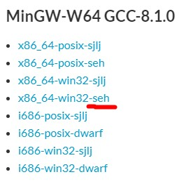
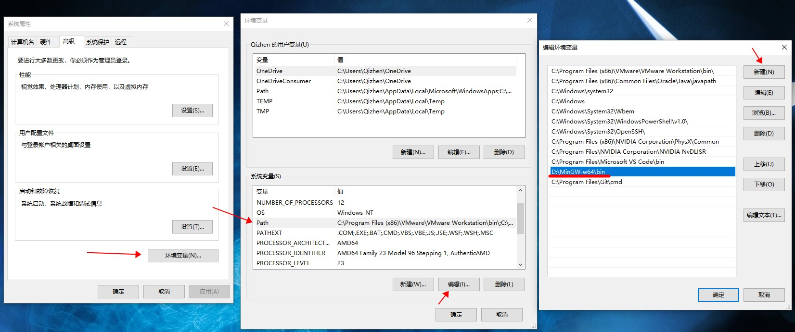
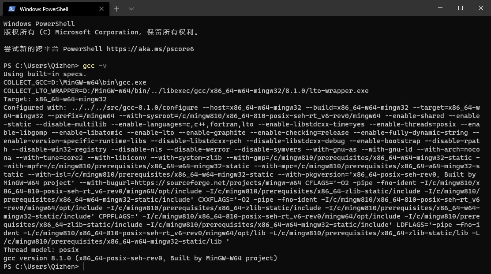
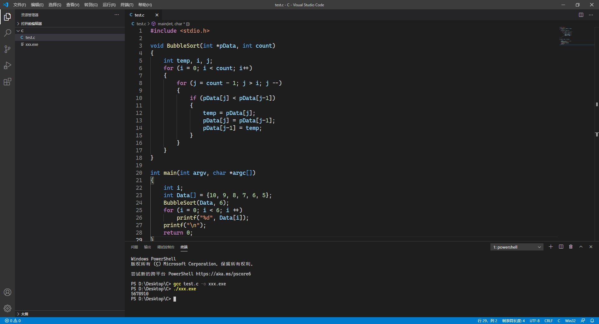
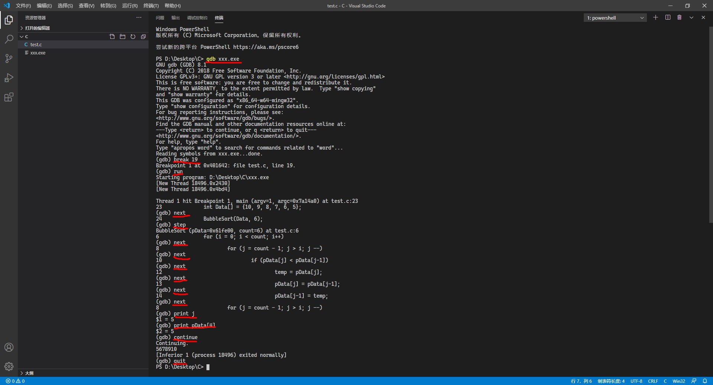

**[回到主页](../)**

# [Windows 下使用 GNU Compiler Collection](posts/../2021-01-17.html)
*2021-01-17*

本文分为两个部分，通过链接可以快速定位内容：
- [编译器环境部署](#env)
- [编译并调试程序](#debug)

我自学 C 语言也有一点时间了，IDE 也换过好几个，就是不喜欢大量的 GUI 操作 (这也是我使用 Linux 的一个原因)。先后使用过的 IDE 有：
- Microsoft Visual C++ 6.0
- Dev-C++ IDE
- Visual Studio 2019

VC6 太古老了，Dev 对于一些大型项目支持不好，VS 的话启动一次太不容易了，这时，我找到了 VS Code。

VS Code 的加载速度很棒，大文件的处理介于 Dev 和 VS 之间，满足了日常的需求。于是，我开始配置环境了。

## 插件安装
网上很多人都说要安装一大堆的插件，我自己使用后感觉没必要，只需要一个 C / C++ (Microsoft 提供) 就够了。

装好之后设置里有很多代码补全等方面的选项，根据个人喜好设置即可。

<a name="env"></a>

## 编译器环境
编译器肯定是 GCC 最好用啊，所以，我们需要一个 GNU 环境，需要用 MinGW-w64 (亲测比 MinGW 好用)。

SourceForge 上的仓库: <https://sourceforge.net/projects/mingw-w64/files/Toolchains%20targetting%20Win64/Personal%20Builds/mingw-builds>

往下翻一点就能看到下载链接。

**千万不要选 Online Installer!**

最好使用最新版，下载 `x86_64-win32-seh` 这个包。



下载好之后是一个包，把它解压到一个目录下（随便哪里都可以）。我选择了 `D:\MinGW-w64`。

直接开始菜单的搜索里搜 **环境变量**，也可以在 控制面板\系统和安全\系统\高级系统设置中找到。

然后将之前解压的目录中的 `bin` 文件夹放入环境变量，如图。



然后重启计算机。

重启之后，打开终端 (Command Prompt, Windows Powershell 等都可以)，输入。

```
gcc -v
```

看到这样的输出，就说明好了。



<a name="debug"></a>

## 使用
首先打开 VS Code，打开一个文件夹，随便写一段 C 语言程序。像这样：

```c
#include <stdio.h>

void BubbleSort(int *pData, int count)
{
	int temp, i, j;
	for (i = 0; i < count; i++)
	{
		for (j = count - 1; j > i; j --)
		{
			if (pData[j] < pData[j-1])
			{
				temp = pData[j];
				pData[j] = pData[j-1];
				pData[j-1] = temp;
			}
		}
	}
}

int main(int argv, char *argc[])
{
	int i;
	int Data[] = {10, 9, 8, 7, 6, 5};
	BubbleSort(Data, 6);
	for (i = 0; i < 6; i ++)
		printf("%d", Data[i]);
	printf("\n");
	return 0;
}
```

然后执行

```
gcc test.c
```

GCC 就在当前目录生成了一个 `a.exe`。

如果要指定一个生成的可执行文件名称，需要这样：

```
gcc text.c -o xxx.exe
```

这时可以输入

```
./xxx.exe
```

就会执行这个程序了。



然后试试看用 GDB 调试。

生成带有调试信息的程序，然后开始调试

```
gcc -g test.c -o xxx.exe
gdb xxx.exe
```

按下回车开始调试。

设置一个断点

```
break 19
```

执行

```
run
```

单步执行

```
next
```

进入函数

```
step
```

查看一个变量

```
print 变量名
```

直接执行到结束

```
continue
```

退出 GDB

```
quit
```

完整调试大概是这样的，画出来的就是需要手动输入的东西



和其它的 GUI 工具相比，还是方便很多。

Linux 的终端和 Windows Powershell 有一个功能，按上下方向键可以快速输入 上一次 / 下一次 执行的命令，也就是说每条命令都有历史记录，如果反复执行同一个操作可以直接按下 上移键，然后回车就可以了。

&copy; 2021 Qizhen Yang