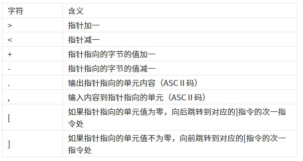
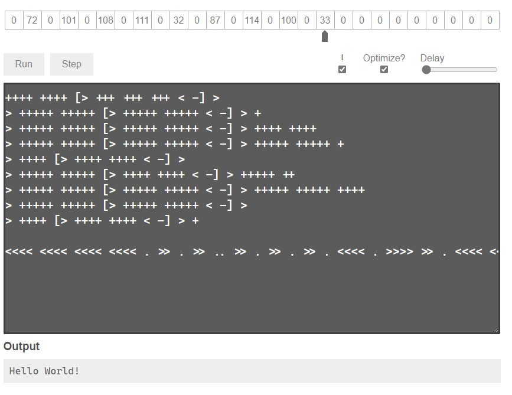

**[回到主页](../)**

# 对于 BF 语言的研究
*2021-02-01*

BF 语言，是对于 BrainFuck 语言的一种比较文明的称呼方式。这是一种按照 Turing complete 思想设计的语言，只有八种符号。



*BF 语言的八种符号，摘自百度百科*

从样子上看，这就非常的有意思。

## `Hello World!`
要入门一门语言，先要编写 `Hello World!` 程序。

BF 的 Hello World 就挺特殊的，所有东西都要用 ASCII 码来输出。

查到对应的 ASCII 码如下：

```
72 101 108 108 111 32 87 111 114 108 100 33
```

先解决 H，八九七十二

```
++++ ++++ [> +++ +++ +++ < -] >
```

e

```
> +++++ +++++ [> +++++ +++++ < -] > +
```

l

```
> +++++ +++++ [> +++++ +++++ < -] > ++++ ++++
```

o

```
> +++++ +++++ [> +++++ +++++ < -] > +++++ +++++ +
```

空格

```
> ++++ [> ++++ ++++ < -] >
```

W

```
> +++++ +++++ [> ++++ ++++ < -] > +++++ ++
```

r

```
> +++++ +++++ [> +++++ +++++ < -] > +++++ +++++ ++++
```

d

```
> +++++ +++++ [> +++++ +++++ < -] >
```

!

```
> ++++ [> ++++ ++++ < -] > +
```

连在一起，加上输出就是

```
++++ ++++ [> +++ +++ +++ < -] >
> +++++ +++++ [> +++++ +++++ < -] > +
> +++++ +++++ [> +++++ +++++ < -] > ++++ ++++
> +++++ +++++ [> +++++ +++++ < -] > +++++ +++++ +
> ++++ [> ++++ ++++ < -] >
> +++++ +++++ [> ++++ ++++ < -] > +++++ ++
> +++++ +++++ [> +++++ +++++ < -] > +++++ +++++ ++++
> +++++ +++++ [> +++++ +++++ < -] >
> ++++ [> ++++ ++++ < -] > +

<<<< <<<< <<<< <<<< . >> . >> .. >> . >> . >> . <<<< . >>>> >> . <<<< <<<< . >>>> >>>> >> . >> .
```

成功！



## 其它程序
Hello World! 写的确实有点累，但是只要不涉及文本，就非常的简洁明了。

比如，输出键盘中输入的字符

C 语言最简单也要这样

```c
putchar(getchar());
```

BF 是这样的

```
,.
```

从键盘读取两个数，将 ASCII 码转换成数字（减去 48）

```
, > , > +++ +++ [- < ---- ---- < ---- ---- >>]
```

## 如何运行
运行 BF 的话，~~相信没有人会用它开发软件~~，一般直接运行都是依赖于 C 语言的，我尝试着写过 **编译器**，~~并失败了~~，官方给出的是 **解释器**，代码如下：

```c
#include <stdio.h>
int p, r, q;
char a[5000], f[5000], b, o, *s = f;
void interpret(char *c)
{
	char *d;
	r++;
	while (*c)
	{

		switch (o = 1, *c++)
		{
		case '<':
			p--;
			break;
		case '>':
			p++;
			break;
		case '+':
			a[p]++;
			break;
		case '-':
			a[p]--;
			break;
		case '.':
			putchar(a[p]);
			fflush(stdout);
			break;
		case ',':
			a[p] = getchar();
			fflush(stdout);
			break;
		case '[':
			for (b = 1, d = c; b && *c; c++)
				b += *c == '[', b -= *c == ']';
			if (!b)
			{
				c[-1] = 0;
				while (a[p])
					interpret(d);
				c[-1] = ']';
				break;
			}
		case ']':
			puts("UNBALANCED BRACKETS"), exit(0);
		case '#':
			if (q > 2)
				printf("- - - - - - - - - -/n%*s/n", *a, a[1], a[2], a[3], a[4], a[5], a[6], a[7], a[8], a[9], 3 * p + 2, "^");
			break;
		default:
			o = 0;
		}
		if (p < 0 || p > 100)
			puts("RANGE ERROR"), exit(0);
	}
	r--;
}
int main(int argc, char *argv[])
{
	FILE *z;
	q = argc;
	if (z = fopen(argv[1], "r"))
	{
		while ((b = getc(z)) > 0)
			*s++ = b;
		*s = 0;
		interpret(f);
	}
	return 0;
}
```

编译后直接给主程序传参就可以运行了。

如果要更直观的运行结果的话，推荐用 Brainfuck Visualizer。[链接](https://fatiherikli.github.io/brainfuck-visualizer/)

## 学习 BF 的意义
没啥用吧，但是可以更好的理解指针。

BF 还有一个好处就是可以把八个符号换成其它符号然后自创编程语言。(bushi

&copy; 2021 Qizhen Yang